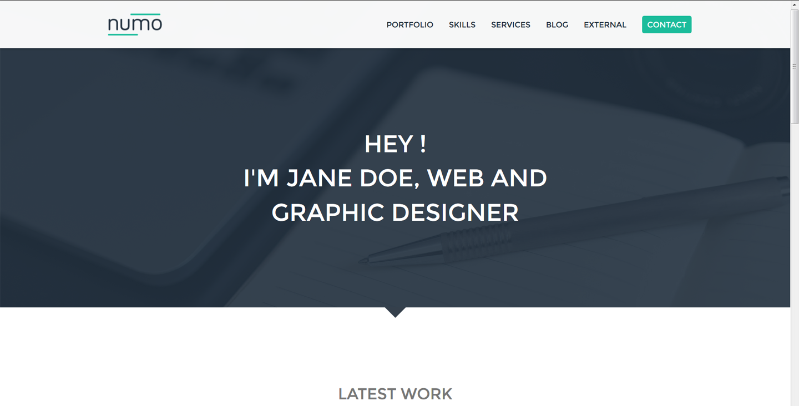

# theme_bootstrap_numo
TYPO3 compatible adaption of the "Numo - Flat Portfolio for Creatives Theme" by MamootStudio

# Features

* Clean, Minimal, Lightweight, Fast
* Cross-Browser Support, Responsive
* Full featured Blog page

# License
Extended Wrap Bootstrap license for this theme has been bought by Cybercraft Media Manufactory, Clausthal-Zellerfeld, Germany.
The extension is redistributed under MIT license and can be freely used and modified according to the terms defined in the LICENSE file.

# Detailed feature description

## colors

The general colors can be choosen by constants.

## layouts

The Homepage is rendered as one page layout, each section is a separate page in the backend.

## rte

In the Rich Text Editor a custom tag can be used to render progressbars.

